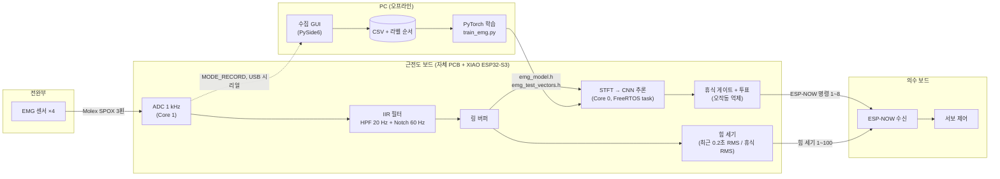
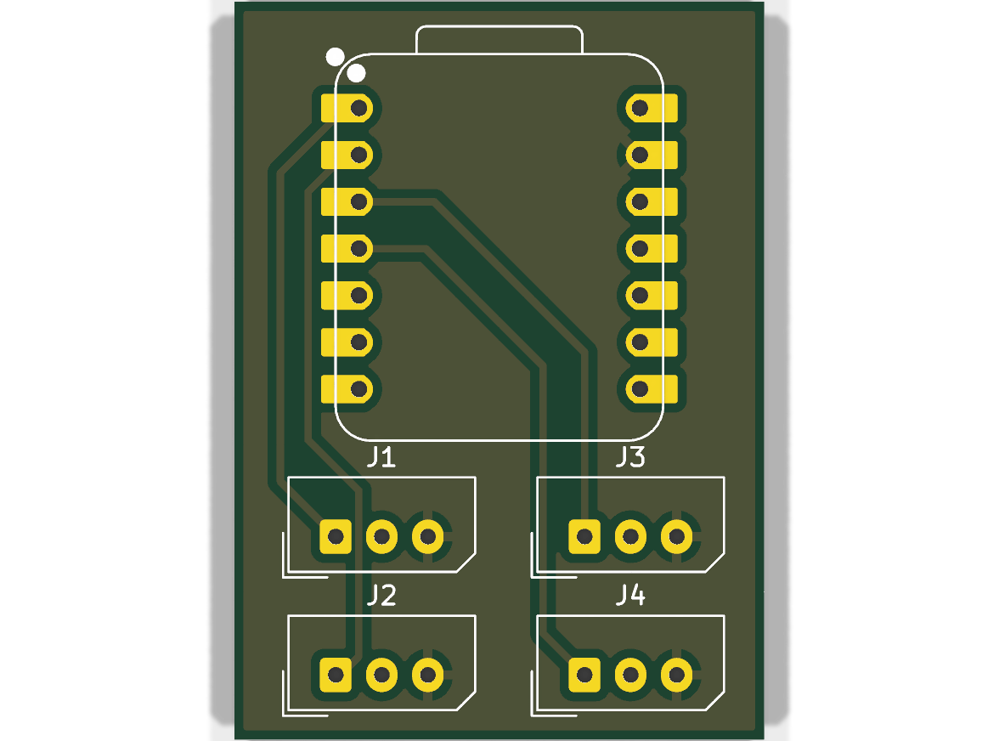
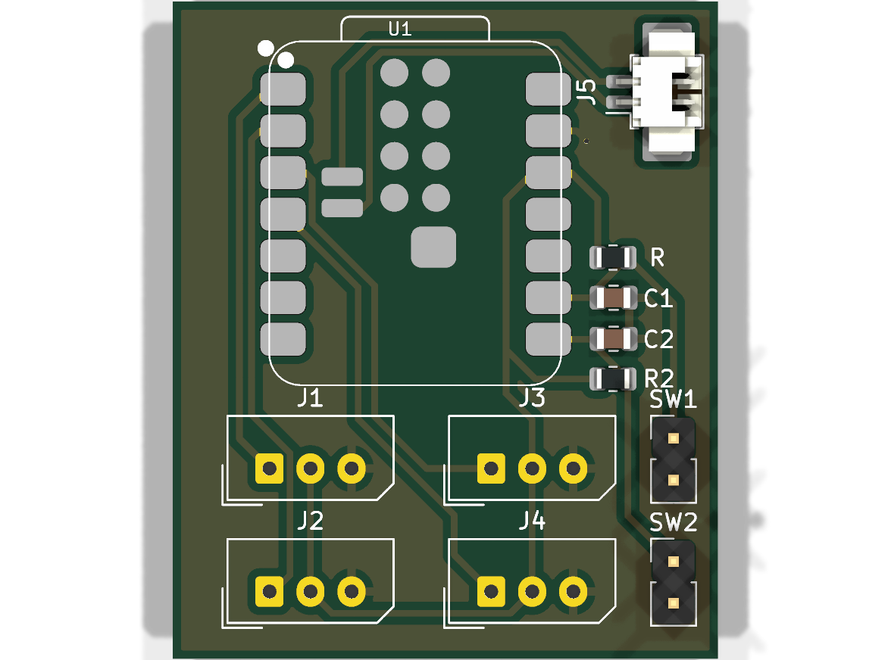
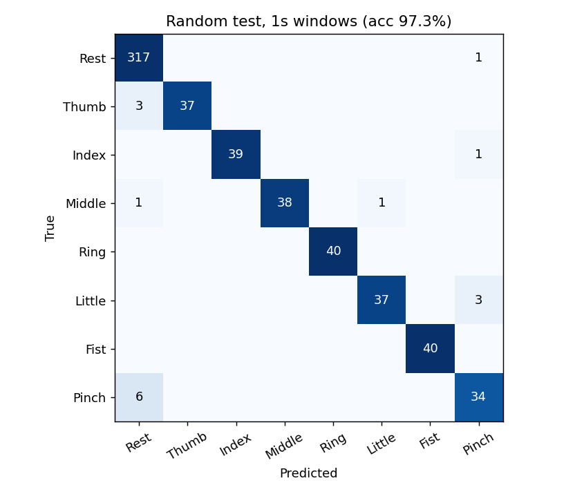
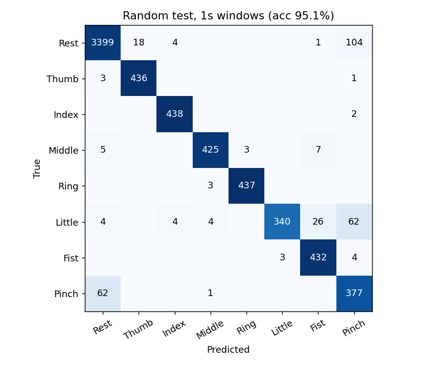
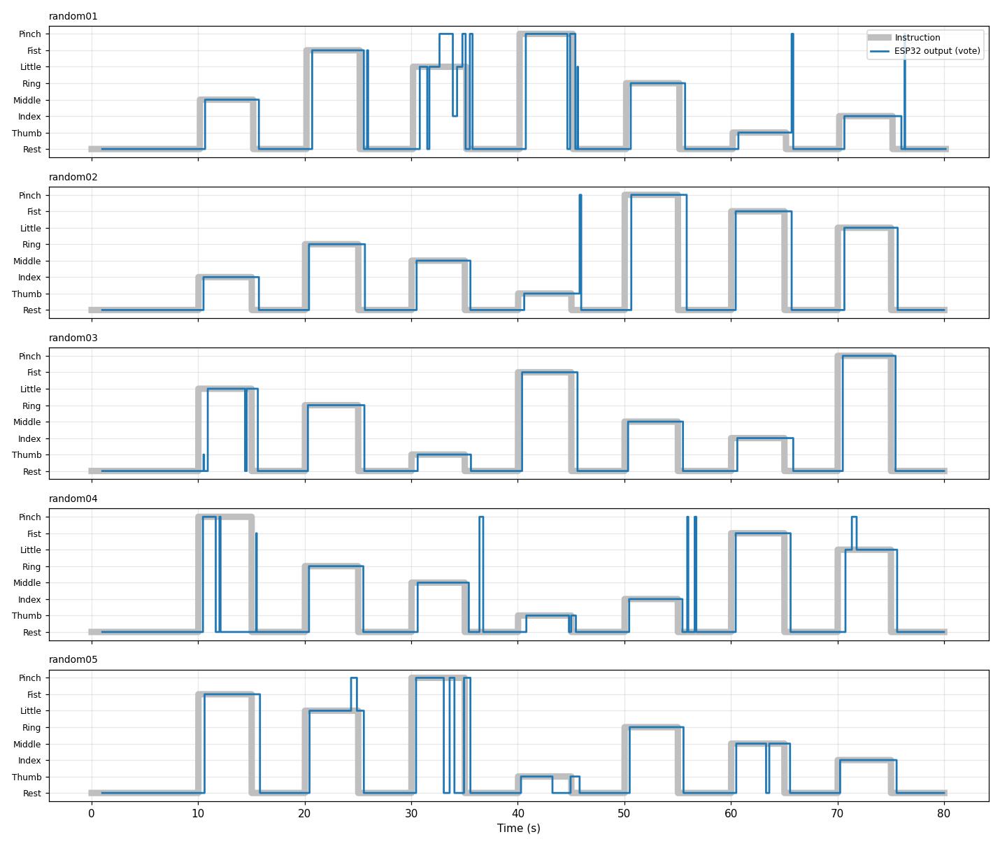

# ReHand — EMG 기반 손가락 동작 인식 의수 제어

> 졸업작품 · **2026.01 – 2026.10** · 4인 팀 (팀장)

전완부 표면 근전도(sEMG) 4채널을 XIAO ESP32-S3로 1 kHz 샘플링하고, **보드 위에서 직접 CNN 추론**으로 손가락 동작 8가지를 분류해 ESP-NOW로 의수 보드에 명령을 보내는 시스템입니다.
PCB 설계 → 데이터 수집 GUI → PyTorch 학습 → C 코드 자동 생성 → 온디바이스 실시간 추론까지 전 과정을 직접 구현했습니다.

| 항목 | 내용 |
|---|---|
| 입력 | 표면 EMG 4채널, 1000 Hz, 12-bit ADC |
| 출력 | 휴식 / 엄지 / 검지 / 중지 / 약지 / 소지 / 주먹 / 집게 (8클래스) |
| MCU | Seeed XIAO ESP32-S3 (듀얼코어, 추론·샘플링 코어 분리) |
| 모델 | STFT 스펙트로그램 + 3층 Conv2D CNN, 파라미터 6,368개 (float 약 25 KB) |
| 통신 | ESP-NOW (근전도 보드 → 의수 보드, 2바이트 {명령 번호, 힘 세기}) |
| 성능 | 미사용 순서 세션 기준 1초 창 정확도 **97.3%**, 실시간 제어 지연 중앙값 **290 ms** (빠른 모드) |

---

## 시스템 구조



### 데이터 파이프라인

1. **수집** — 펌웨어를 `MODE_RECORD`로 올리고 GUI가 5초 힘주기 / 5초 쉬기를 안내하며 녹화 (1세션 = 8동작 × 10초 = 80초)
2. **전처리** — 4차 Butterworth HPF 20 Hz + 60 Hz 노치 (PC와 ESP32에서 **같은 SOS 계수**로 계산)
3. **특징** — 창마다 채널별 z-score 정규화 → Hamming 창 STFT → 주파수 밴드 평균 → log 파워
4. **모델** — Conv(8) → Conv(16) → Conv(32) → Global Avg Pool → FC. BatchNorm은 내보낼 때 Conv에 접어(fold) 넣음
5. **내보내기** — 가중치·필터 계수·클래스 이름을 C 헤더로 생성, PC 예측값을 **골든 테스트 벡터**로 함께 내보냄
6. **온디바이스** — Core 1은 1 kHz 샘플링만, Core 0은 추론 태스크. 출력은 투표 로직을 거쳐 ESP-NOW로 전송

---

## 폴더 구조

```
rehand-emg-prosthesis/
├─ hardware/                 KiCad 프로젝트 (근전도 보드)
│  ├─ v1/                    초기 보드: 회로도 · PCB · gerber/
│  └─ v2/                    현재 보드 (배터리 · 버튼 추가): 회로도 · PCB · gerber/
├─ collector/                데이터 수집 GUI (PySide6 + pyserial)
│  └─ emg_collector_v4.py
├─ training/                 학습 + ESP32용 C 헤더 생성
│  ├─ train_emg.py           python train_emg.py [--fast]
│  ├─ data/Fixed/            고정 순서 세션 15개 (학습/검증)
│  ├─ data/Random/           무작위 순서 세션 5개 (테스트 전용)
│  ├─ output/                정확 모드 결과 (report, 그림, 모델)
│  └─ output_fast/           빠른 모드 결과
├─ firmware/                 Arduino (XIAO ESP32-S3)
│  ├─ esp32_emg_realtime/    녹화 · 센서 점검 · 실시간 판단 · 재생 (모드 전환)
│  ├─ esp32_emg_test/        PC ↔ ESP32 결과 일치 검증 (골든 테스트)
│  └─ esp32_emg_bench/       단계별 연산 시간 측정 (STFT+CNN vs 시간영역 특징)
└─ docs/
   ├─ hand_board_patch.md    의수 보드 ESP-NOW 수신부 수정 내역
   └─ images/                결과 그림
```

---

## 하드웨어

<p align="center">
  
  
  <br><sub>왼쪽 v1 · 오른쪽 v2 (현재)</sub>
</p>

| | v1 | v2 (현재) |
|---|---|---|
| 크기 | 28.75 × 40 mm | 33.2 × 40 mm |
| MCU 실장 | XIAO ESP32-S3 DIP 풋프린트 | XIAO ESP32-S3 **SMD** 풋프린트 (하단 BAT 패드 사용) |
| 센서 입력 | Molex SPOX 3핀 ×4 (신호 / 3V3 / GND → A0~A3) | 동일 |
| 전원 | USB | **J5 PicoBlade 2핀** → XIAO BAT 패드 (배터리 연결) |
| 입력 버튼 | 없음 | **SW1 · SW2** (D7 · D8), 풀업 저항 + 디바운스 커패시터 (0805) |
| 회로도 | [schematic_v1.svg](docs/images/schematic_v1.svg) | [schematic_v2.svg](docs/images/schematic_v2.svg) |

- 브레드보드 배선에서 생기던 접촉 불량과 잡음을 줄이기 위해 전용 보드로 제작
- v2에서는 착용형으로 쓰기 위해 배터리 입력을 추가하고, 버튼 2개를 하드웨어 풀업·RC 디바운스와 함께 넣음
  - **SW1**: 근전도 모드 ↔ 매크로 모드 전환 (보드 LED가 켜지면 매크로 모드)
  - **SW2**: 매크로 모드에서 다음 동작 선택 (명령 11~19). 근전도 모드에서는 사용자 보정 기능 자리로 예약
  - 버튼은 별도 FreeRTOS 태스크가 10 ms마다 읽어 1 kHz 측정 루프에 영향이 없음. 스위치가 없는 보드에서는 시리얼 `1`/`2` 또는 BOOT 버튼(짧게/길게)으로 대신 조작

---

## 힘 세기 → 의수 속도

CNN은 창마다 채널을 z-score 정규화한 뒤 **모양**만 보기 때문에 "얼마나 세게" 힘을 줬는지는 알 수 없습니다.
그래서 동작 종류는 CNN이, 세기는 신호 크기로 따로 재서 함께 보냅니다.

- **세기(배)** = 최근 0.2초 RMS ÷ 휴식 RMS, 4채널 중 최댓값 (`emg_strength()`)
- **세기(%)** = 휴식 게이트 크기를 0%, 동작별 기준을 100%로 놓고 환산 → 1~100으로 전송 (휴식·매크로 모드는 0 = 기본 속도)
- **동작별 기준**: 같은 힘이어도 동작마다 신호 크기가 크게 달라서(엄지 약 6배, 약지 약 40배) 녹화 20세션에서 "인식 직후 0.5초 평균"의 중앙값을 동작별로 사용
- **안정화**: 동작 시작 순간에는 바로 반영하고 이후 지수 평활(α = 0.5). 필요하면 약/강, 약/중/강 단계 출력 + 히스테리시스로 전환 가능
- **보정 지원**: 동작이 끝날 때마다 시리얼에 `세기 요약`(처음 0.5초 평균 / 이후 평균)을 출력해 센서를 다시 붙였을 때 기준을 쉽게 다시 맞춤
- 인식 직후 첫 값은 근전도가 아직 커지는 중이라 들쭉날쭉하므로, 의수 보드는 첫 값으로 속도를 고정하지 않고 움직이는 동안 계속 갱신하도록 함 → [docs/hand_board_patch.md](docs/hand_board_patch.md)

---

## 성능

평가는 **학습에 쓰지 않은 Random 세션 5개**(동작 순서를 무작위로 섞어 녹화, 총 6.7분)로 했습니다. 고정 순서만 학습하면 "순서"를 외울 수 있기 때문에 테스트 세트를 순서가 다른 세션으로 분리했습니다.

### 분류 정확도

| 지표 | 정확 모드 | 빠른 모드 |
|---|---|---|
| 창 단위 정확도 (8클래스) | **97.3%** | 95.1% |
| 창 단위 정확도 (휴식 제외 7동작) | 94.6% | 93.7% |
| 수축 구간 다수결 | 97.5% (39/40) | 97.5% (39/40) |

클래스별 (정확 모드): 휴식 100%, 엄지 92%, 검지 98%, 중지 95%, 약지 100%, 소지 92%, 주먹 100%, 집게 85%

<p align="center">
  
  
</p>

### 실시간 제어 (실제 판단 주기와 투표 로직을 그대로 재현한 시뮬레이션)

| 지표 | 정확 모드 | 빠른 모드 |
|---|---|---|
| 판단 창 / 주기 | 1.0 s / 500 ms | 0.5 s / 50 ms |
| 근전도 시작 → 올바른 출력 (중앙값) | 1007 ms | **290 ms** |
| 근전도 시작 → 올바른 출력 (90%) | 1482 ms | 790 ms |
| 힘 뺀 뒤 출력 해제 (중앙값) | 394 ms | **243 ms** |
| 동작 인식 성공 / 놓침 | 35 / 0 | 35 / 0 |
| 잘못된 손가락 출력 (6.7분) | **0회** | 6회 |
| 휴식 중 오작동 비율 | 0.0% | 0.4% |



### 경량화

| | 기존 MATLAB 모델 | 이 프로젝트 (정확) | 이 프로젝트 (빠른) |
|---|---|---|---|
| 1회 판단 곱셈 수 | 약 231 M | 0.44 M | 0.14 M |
| 파라미터 | – | 6,368 (≈25 KB) | 6,368 (≈25 KB) |

연산량을 **약 500~1600배** 줄여 ESP32-S3에서 50 ms 주기 추론이 가능해졌습니다. 펌웨어는 추론이 주기 안에 끝나지 않으면 `판단 건너뜀` 카운터로 표시합니다.

---

## 트러블슈팅

### 1. 여러 채널이 같은 필터 상태를 공유하는 문제
- **증상**: 채널을 4개로 늘리자 한 채널에 힘을 줘도 다른 채널 파형이 같이 흔들림
- **원인**: 사용하던 `EMGFilters` 라이브러리가 LPF/HPF/노치 필터의 내부 상태를 **파일 전역 변수**로 갖고 있어, 채널마다 객체를 만들어도 상태가 섞임
- **해결**: 필터 상태를 클래스 멤버로 옮겨 인스턴스마다 독립되게 수정 ([EMGFilters.h](firmware/esp32_emg_realtime/EMGFilters.h))

### 2. 녹화 중 샘플 손실 → 라벨 밀림
- **증상**: 80초 녹화인데 CSV 줄 수가 모자라거나, 뒤쪽 동작 구간이 앞 동작 신호와 섞임
- **원인**: 샘플링과 USB 시리얼 전송을 같은 루프에서 하다 보니, PC 쪽 읽기가 잠깐 멈추면 `Serial.write`가 막혀 1 kHz 샘플링이 밀림. 또 GUI가 녹화를 시작하기 전에 쌓인 옛 데이터가 녹화 앞부분에 섞임
- **해결**
  - 샘플링(Core 1)과 전송(Core 0)을 분리하고 16k 샘플 링 버퍼로 연결
  - 1초 이상 밀리면 오래된 데이터를 버리고 실시간으로 다시 맞춤, 이때 LED를 켜서 불량 녹화를 바로 알 수 있게 함
  - 학습 코드에서 길이가 5초 ± 5%를 벗어난 구간은 자동으로 제외

### 3. 시리얼 전송 중 깨진 값
- **증상**: `73-6.0`처럼 두 값이 붙은 줄 때문에 CSV 파싱 실패
- **해결**: 숫자로 변환 불가능한 값은 NaN 처리 후 앞뒤 값으로 채움 (`pd.to_numeric(errors="coerce").ffill()`)

### 4. 센서 접촉 불량 데이터가 학습을 망침
- **증상**: 특정 세션이 섞이면 전체 정확도가 크게 떨어짐. 원인을 찾아보면 전극이 떠 있던 세션
- **해결**: 학습 전 자동 품질 검사 추가
  - 수축 구간 RMS가 휴식 대비 1.3배 미만인 세션 자동 제외
  - 어떤 동작에도 반응하지 않는 채널 / 휴식 때부터 잡음이 큰 채널 경고
  - 펌웨어 `MODE_CHECK`로 녹화 전에 채널별 흔들림 · 클리핑 확인

### 5. 학습과 실시간 입력이 달라서 생기는 정확도 저하
- **증상**: PC 검증 정확도는 높은데 보드에 올리면 판단이 불안정
- **원인**: 녹화용 코드와 판단용 코드의 ADC 읽기·필터 경로가 달랐음
- **해결**
  - 녹화(`MODE_RECORD`)와 판단(`MODE_RUN`)을 한 스케치로 합치고 같은 `readEmgInput()`을 사용
  - PC 필터도 `filtfilt`(양방향) 대신 기기와 같은 인과 필터 `sosfilt`를 파일 처음부터 연속 적용
  - 학습 스크립트가 PC 예측 확률을 `emg_test_vectors.h`로 내보내고, `esp32_emg_test`에서 ESP32 결과와 비교 → **PC와 C 구현의 확률 차이까지 검증**

### 6. MATLAB 모델을 MCU에 올릴 수 없는 문제
- **원인**: 기존 모델은 1회 판단에 약 2.3억 번 곱셈 → ESP32에서 실시간 불가
- **해결**: 입력을 STFT 밴드 평균(채널당 22×24 또는 13×14)으로 줄이고, 3층 소형 CNN + Global Average Pooling으로 FC 파라미터를 최소화. BN을 Conv에 접어서 추론 시 연산 제거
- `esp32_emg_bench`로 필터 / STFT / CNN 단계별 시간과 시간영역 특징(MAV·RMS·WL·ZC·SSC) 방식을 비교해 구조를 결정

### 7. 반응 속도 vs 오작동 트레이드오프
- **문제**: 1초 창 · 0.5초 주기는 오작동이 0회지만 반응이 1초 가까이 늦어 의수로 쓰기 답답함
- **해결**: 0.5초 창을 50 ms마다 판단하는 빠른 모드 추가, 대신 늘어나는 오판을 규칙으로 억제
  - **휴식 게이트**: 모든 채널 RMS가 휴식 기준의 2배 미만이면 무조건 휴식
  - **히스테리시스 투표**: 켜기는 3회 연속, 다른 동작으로 전환은 5회 연속, 끄기는 휴식 1회
  - 라벨을 창의 "끝부분" 상태 + 사람 반응 지연(50~150 ms)으로 맞춰 힘을 빼면 빨리 풀리도록 학습
- **1차 결과**: 제어 지연 1007 ms → **290 ms**, 해제 394 ms → 104 ms. 하지만 6.7분 동안 엉뚱한 손가락 출력이 **15회**
- **2차 조정**: 출력이 짧게 바뀌었다 돌아오는 오출력을 줄이기 위해 출력을 바꾸는 조건을 더 엄격하게 함
  - 다른 동작으로 전환: 5회 → **8회 연속**
  - 끄기: 휴식 1회 → **3회 연속** (휴식 판단 한 번에 껐다 켜지는 깜빡임 방지)
  - **최소 유지 시간 0.5초**: 출력이 바뀐 뒤 10회 판단 동안은 다시 바꾸지 않음
  - PC 시뮬레이션(`vote_sequence`)과 ESP32(`emg_vote_update`)에 같은 규칙을 넣고 파라미터는 `emg_model.h`로 자동 생성
- **최종 결과**: 제어 지연 **290 ms 유지**, 오출력 15회 → **6회**, 대신 해제는 104 ms → 243 ms로 늘어남

### 8. 시리얼 출력 때문에 추론이 밀림
- **증상**: PC에서 시리얼 모니터를 닫으면 판단 주기가 늘어짐
- **원인**: USB CDC 버퍼가 차면 `Serial.printf`가 블로킹
- **해결**: 판단 모드에서 `Serial.setTxTimeoutMs(0)`로 PC가 안 읽으면 출력 버림, 빠른 모드는 출력 변경 시 + 1초마다만 출력

### 9. 의수가 명령을 받지만 움직이지 않음
- **원인 1**: 의수 보드의 ESP-NOW 콜백이 플래그만 세우고 `loop()`에서 확인하지 않음
- **원인 2**: 수신 조건이 `cmd <= 6`이라 새로 추가한 주먹(7) · 집게(8)가 무시됨
- **해결**: `loop()`에서 플래그를 확인해 실행 (서보 버스를 WiFi 태스크 콜백 안에서 쓰지 않도록), 범위를 1~8로 확장. 근전도 보드는 0.5초마다 현재 명령을 재전송해 패킷 손실에도 복구 → [docs/hand_board_patch.md](docs/hand_board_patch.md)

---

## 실행 방법

### 1. 설치
```bash
pip install -r training/requirements.txt -r collector/requirements.txt
```

### 2. 데이터 수집
1. `firmware/esp32_emg_realtime/esp32_emg_realtime.ino`에서 `#define RUN_MODE MODE_CHECK`로 업로드 → 채널 상태 확인
2. `MODE_RECORD`로 업로드 후 `python collector/emg_collector_v4.py`
3. 고정 순서는 `training/data/Fixed/`, 무작위 순서는 `training/data/Random/`에 저장 (순서는 `_order.txt`로 자동 기록)

### 3. 학습
```bash
python training/train_emg.py          # 정확 모드
python training/train_emg.py --fast   # 빠른 모드
```
생성된 `emg_model.h`, `emg_test_vectors.h`가 `firmware/`의 세 스케치 폴더에 자동 복사됩니다.

### 4. 검증 및 실행
| 스케치 | 용도 |
|---|---|
| `esp32_emg_test` | PC 결과와 일치 여부 확인 (`8 / 8 통과`) |
| `esp32_emg_bench` | 단계별 연산 시간 측정 |
| `esp32_emg_realtime` (`MODE_RUN`) | 실시간 판단 + ESP-NOW 전송 |
| `esp32_emg_realtime` (`MODE_REPLAY`) | 센서 없이 저장 데이터로 판단 흐름 확인 |

Arduino IDE 설정: 보드 `XIAO_ESP32S3`, `USB CDC On Boot: Enabled`

---

## 변경 이력

| 날짜 | 변경 내용 |
|---|---|
| 2026-10-07 | **힘 세기 전송**: 동작 종류와 함께 힘 세기(1~100)를 2바이트 패킷으로 전송, 의수 보드에서 서보 속도로 사용. 동작별 100% 기준, 평활화, 단계 출력 옵션, 세기 요약 출력 추가 |
| 2026-10-06 | **근전도 / 매크로 모드**: SW1로 모드 전환, SW2로 매크로 동작(명령 11~19) 선택. 버튼 전용 FreeRTOS 태스크, 시리얼·BOOT 버튼 대체 입력 |
| 2026-10-02 | **빠른 모드 투표 규칙 강화**: 끄기 3회 연속, 전환 8회 연속, 최소 유지 0.5초 추가 → 오출력 15회 → 6회 (6.7분 기준) |
| 2026-09-30 | **PCB v2**: XIAO SMD 실장, 배터리 커넥터, 버튼 2개(풀업 + RC 디바운스) 추가 |
| 2026-09-30 | 저장소 공개: 하드웨어 · 수집 GUI · 학습 · 펌웨어 · 문서 정리 |

---

## 기술 스택
`Python` `PyTorch` `NumPy/SciPy` `PySide6` · `C/C++ (Arduino, FreeRTOS)` · `KiCad`

## 라이선스 / 출처
- `firmware/esp32_emg_realtime/EMGFilters.*`: OYMotion Inc. (BSD-3-Clause), 채널별 상태 분리 수정
